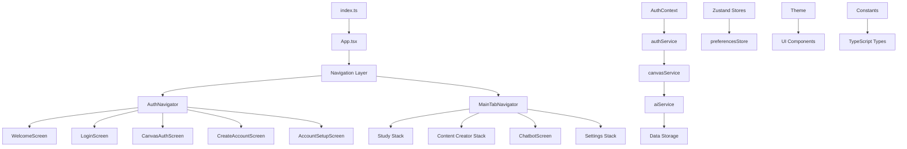

# AI Study Companion - Architecture Map

This document provides a comprehensive overview of the application's architecture, folder structure, and file relationships. Use this as a reference to understand how different components communicate and depend on each other.

## 🏗️ High-Level Architecture



## 📁 Folder Structure & Responsibilities

### `/src` - Application Source Code
The main application source code organized by responsibility:

#### **📱 `/screens`** - UI Screens
- **Purpose**: Full-screen React Native components
- **Dependencies**: 
  - UI components (`../components/ui/`)
  - Services (`../services/`)
  - Contexts (`../contexts/`)
  - Navigation types (`../navigation/`)
- **Key Files**:
  - `WelcomeScreen.tsx` → `LoginScreen.tsx` → `CanvasAuthScreen.tsx` (Auth Flow)
  - `StudyQueueScreen.tsx` → `FlashcardStudyScreen.tsx`/`QuizStudyScreen.tsx` (Study Flow)
  - `ContentCreatorScreen.tsx` → `FlashcardCreationScreen.tsx` (Creation Flow)
  - `ChatbotScreen.tsx` (AI Chat Interface)
  - `SettingsScreen.tsx` + settings sub-screens (Configuration)

#### **🔧 `/services`** - Business Logic Layer
- **Purpose**: Core business logic and external API integrations
- **Communication Pattern**: Services communicate with each other and are consumed by screens/contexts

**Service Dependency Chain:**
```
authService ←→ canvasService ←→ aiService
     ↓              ↓             ↓
AsyncStorage   Canvas API    AI Providers
     ↓              ↓             ↓
SecureStore    Study Data   Generated Content
```

**Key Service Files:**
- **`authService.ts`**: User authentication, account management
  - Dependencies: `expo-secure-store`, `expo-crypto`
  - Used by: `AuthContext`, login screens
  - Communicates with: `canvasService` (for Canvas credentials)

- **`canvasService.ts`**: Canvas LMS API integration
  - Dependencies: `axios`, `AsyncStorage`, `authService`
  - Used by: Study screens, content creation
  - Provides: Course data, assignments, files

- **`aiService.ts`**: AI content generation orchestration
  - Dependencies: `openaiService`, `llm/client`, `userPreferencesService`
  - Used by: Content creation, chatbot, study assistant
  - Generates: Flashcards, quizzes, summaries, chat responses

- **`contentProcessingService.ts`**: Content chunking and processing
  - Dependencies: Text processing utilities
  - Used by: `aiService` for large content handling

- **`flashcardStorage.ts`**: Flashcard persistence and retrieval
  - Dependencies: `AsyncStorage`, spaced repetition algorithms
  - Used by: Study screens, content creation

- **`spacedRepetitionService.ts`**: SM-2 learning algorithm
  - Dependencies: Mathematical calculations
  - Used by: `flashcardStorage`, study tracking

#### **🎨 `/components/ui`** - Reusable UI Components
- **Purpose**: Consistent, themeable UI primitives
- **Dependencies**: Theme system, React Native primitives
- **Used by**: All screens

**Component Hierarchy:**
```
Screen (wrapper) 
├── Header (navigation headers)
├── Card (content containers)
├── Button (actions)
├── Input (form fields)
├── EmptyState (no-content states)
├── Select (dropdowns)
└── Toggle (boolean controls)
```

#### **🧭 `/navigation`** - App Navigation Structure
- **Purpose**: Navigation configuration and route management
- **Key File**: `AppNavigator.tsx`
- **Structure**:
  ```
  NavigationContainer
  └── AuthNavigator (RootStack)
      ├── Auth Screens (Welcome → Login → Canvas → Account Creation → Setup)
      └── MainApp (TabNavigator)
          ├── StudyQueue (Stack Navigator)
          ├── ContentCreator (Stack Navigator)  
          ├── Chatbot (Single Screen)
          └── Settings (Stack Navigator)
  ```

#### **🔄 `/contexts`** - React Context Providers
- **Purpose**: Global state management using React Context
- **Key File**: `AuthContext.tsx`
- **Responsibilities**:
  - Authentication state management
  - User session handling
  - Auth flow coordination between screens and services

#### **🗄️ `/store`** - Zustand State Management
- **Purpose**: Global app state with persistence
- **Key File**: `preferencesStore.ts`
- **Dependencies**: Zustand for state, AsyncStorage for persistence
- **Used by**: Settings screens, AI services for user preferences

#### **📚 `/lib`** - Utility Libraries and Abstractions
- **Purpose**: Reusable utility code and abstractions
- **Subfolders**:
  - `/llm` - LLM client abstraction layer
  - `/prompt` - AI prompt building utilities  
  - `/quiz` - Quiz generation logic
  - `/emoji` - Emoji utilities for theming

#### **⚙️ `/constants`** - Application Configuration
- **Purpose**: Centralized configuration and constants
- **Key File**: `index.ts`
- **Contents**: API configs, themes, routes, defaults
- **Used by**: All components for consistent configuration

#### **📄 `/types`** - TypeScript Type Definitions
- **Purpose**: Centralized type definitions
- **Key File**: `index.ts`
- **Contents**: Canvas API types, app data models, component props
- **Used by**: All TypeScript files for type safety

#### **🎨 `/theme`** - Theme System
- **Purpose**: Centralized styling and theming
- **Key File**: `index.ts`
- **Dependencies**: Constants for color definitions
- **Used by**: UI components, screens for consistent styling

#### **🔧 `/utils`** - Utility Functions
- **Purpose**: Helper functions and configuration utilities
- **Key Files**: 
  - `aiConfig.ts` - AI provider configuration
  - `chatbotExamples.ts` - Example prompts and responses

#### **📊 `/models`** - Data Models
- **Purpose**: Data structure definitions and business logic models
- **Key File**: `preferences.ts`
- **Used by**: Preferences store, settings screens

## 🔄 Data Flow Patterns

### Authentication Flow
```
User Input → AuthContext → authService → SecureStore/Canvas API
     ↑                                         ↓
Navigation ←── Authentication State ←── Validation/Storage
```

### Study Session Flow  
```
StudyQueueScreen → canvasService → Study Data
       ↓                ↓
flashcardStorage ← contentProcessingService → aiService → Generated Content
       ↓                                           ↓
spacedRepetitionService                    AI Provider (OpenAI/Mock)
```

### Content Creation Flow
```
ContentCreatorScreen → User Input → aiService → AI Provider
            ↓                         ↓
    flashcardStorage ←── Processing ←── Generated Content
            ↓
    Study Queue (for review)
```

### Settings & Preferences Flow
```
Settings Screens → preferencesStore → AsyncStorage
       ↑                  ↓
   UI Updates ←── Zustand State → Services (AI context, theming)
```

## 🔗 Key Communication Patterns

### 1. **Screen → Service → Storage**
Most common pattern for data operations:
- Screens call services for business operations
- Services handle API calls and data processing  
- Services persist data to appropriate storage (SecureStore/AsyncStorage)

### 2. **Context → Service Integration**
Authentication and global state:
- `AuthContext` orchestrates authentication flow
- Calls `authService` for account operations
- Updates React state to trigger UI re-renders

### 3. **Service Inter-Communication**
Services depend on each other in a layered approach:
- `aiService` → `userPreferencesService` (for personalization)
- `canvasService` → `authService` (for credentials)
- `flashcardStorage` → `spacedRepetitionService` (for learning algorithms)

### 4. **Theme & UI Consistency** 
Centralized styling system:
- `constants/index.ts` defines theme colors and spacing
- `components/ui/` components use theme tokens
- All screens import UI components rather than raw React Native

### 5. **Type Safety Chain**
TypeScript types ensure consistency:
- `types/index.ts` defines data models
- Services implement typed interfaces
- Screens receive typed props and data

## 🚀 Getting Started for New Developers

### 1. **Start with Navigation** (`src/navigation/AppNavigator.tsx`)
Understand the app's screen flow and routing structure.

### 2. **Explore a Complete Flow**
Follow the authentication flow:
`WelcomeScreen` → `CanvasAuthScreen` → `CreateAccountScreen` → `AccountSetupScreen`

### 3. **Understand the Service Layer**
- Start with `authService.ts` for authentication concepts
- Move to `canvasService.ts` for API integration patterns  
- Explore `aiService.ts` for AI integration

### 4. **Study the UI System**
- Check `constants/index.ts` for theme definitions
- Look at `components/ui/Button.tsx` as a component example
- See how screens use UI components consistently

### 5. **Trace Data Flow**
Pick a feature like "Create Flashcards":
`ContentCreatorScreen` → `aiService.generateFlashcards()` → `flashcardStorage.saveFlashcards()` → Study Queue

## 🔧 Development Tips

- **Always use UI components** from `/components/ui/` instead of raw React Native
- **Check existing services** before creating new API calls
- **Follow the theme system** - use `THEME.colors.primary` not hardcoded colors
- **Use TypeScript types** from `/types/index.ts` for consistency
- **Understand the auth flow** - some screens require authentication state
- **Test on both platforms** - this is a React Native (mobile) app

## 📱 Screen Dependencies Quick Reference

| Screen | Primary Dependencies | Key Services Used |
|--------|---------------------|-------------------|
| WelcomeScreen | UI components, Navigation | None |
| LoginScreen | AuthContext, UI components | authService |
| CanvasAuthScreen | canvasService, AuthContext | authService, canvasService |
| StudyQueueScreen | Canvas data, Flashcard storage | canvasService, flashcardStorage |
| FlashcardStudyScreen | Study algorithms, Storage | spacedRepetitionService, flashcardStorage |
| ContentCreatorScreen | AI generation, Canvas data | aiService, canvasService |
| ChatbotScreen | AI services, Chat history | aiService, chatbotService |
| SettingsScreen | Preferences, Auth | preferencesStore, authService |

This architecture supports a scalable, maintainable React Native app with clean separation between UI, business logic, and data layers. The cosmic theme and emoji-based design create a unique and engaging study experience! 🚀✨